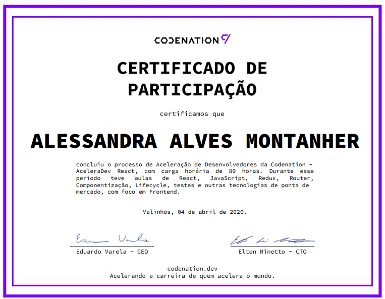

# About

Codenation is a company that offers training courses (AceleraDev) in the technology area in partnership with sponsoring companies.

This repository contains all the classes taken during the course in which I was able to learn about html, css, js and react

# AceleraDev React

AceleraDev Frontend React is a training program for professionals in the area of software development, which will select and prepare students and technology professionals over 10 weeks with practical programming exercises focused on the reality of the market, in addition to exclusive mentoring.

# Project Repository

https://github.com/codenation-dev/squad-1-ad-react-kroton-2

# Project Deploy

https://trackerr.now.sh

# Certificate of Completion

