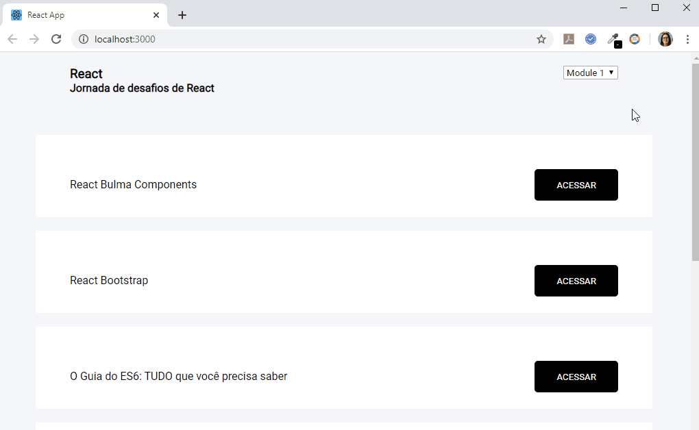

## Links to Study

In the project directory, you can run:

### `yarn start`

Runs the app in the development mode. 
Open [http://localhost:3000](http://localhost:3000) to view it in the browser.

### CI/CD Status

## Goal

This repository contains a single page that shows links to be studied about html, css, js and react.

