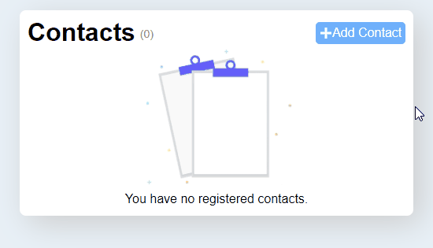

# Criar uma agenda de contatos usando o Redux para gerenciar o estado

At this point in the championship, we have already seen a recurring pain: sharing information with the entire application.
What to do when two components need the same data? And if one of them is responsible for changing, how to immediately send this new information to the other without everything becoming a big mess?
For this we use a `state manager`, which is Redux! Make a contact list to see how simple it is to keep data shared with the entire application when we use it!

## Requirements

On the first run, run the command:

```bash
$ npm install
```

Then, to start developing:

```bash
$ npm start
```

## Topics

With this challenge, you will learn:

- Flux pattern
- Redux
- Redux Persist

### Tasks

- Route `/`
  - Must list all registered contacts
    - Each contact must have a 'Link' to the edit page
    - Each contact must have an action of `Remove from List`
  - Display at least the fields of `Name` and` Email`
  - Contain a 'Link` to the page to create a new contact
  - Contain the total number of contacts
  - If there is no contact yet, it must contain an `Empty State`
- Route `/create`
  - Must have a form to create a new contact
    - It can contain as many fields as you want, but it is necessary to have `Name` and` Email`
  - There must be an action of `Create contact`
- Route `/:contato_id/edit`
  - You must try to find the contact via the ID parameter
    - If the contact does not exist, redirect to route `/ 404`
    - If it exists
      - Must have a form to edit a contact
      - It must contain the same fields as the creation form, however, they must be filled with the user's data
      - Only when clicking on save that the data must be updated
      - Must contain a `Save` action
- Route `/404`
  - Must contain a link to return to the home screen

### Example


### My Final Result



### Attention (Tests)

- The element with the total of contacts must contain an attribute `data-test` with the value` total - $ {totalDeCotnatos} `
- Each `edit contact` link must contain a` data-test` attribute with the value `edit`
- Each action of `remove contact` must contain an attribute` data-test` with the value `delete`
- The `Empty State` container must contain a` data-test` attribute with the value `contactless`
- The 'Create new contact' link must contain a `data-test` attribute with the value `new-contact`
- The `input` element for changing/registering the `name` of the contact, must have a `data-test` attribute with the value `name`
- The `input` element for changing/registering the contact's `email`, must have a `data-test` attribute with the value `email`
- The action of "Create new contact" must contain an attribute `data-test` with the value `create`
- The action of `Save contact` must contain an attribute `data-test` with the value `save`